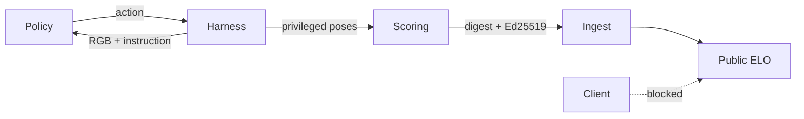

# VSArena

**The official open benchmark for embodied (VLA) policies.**

Server-authoritative stacking evaluation · signed results · public ELO the client cannot write.

[Site](https://vsarena.vercel.app) ·
[Leaderboard](https://vsarena.vercel.app/leaderboard) ·
[Work cell](https://vsarena.vercel.app/simulation) ·
[Protocol](docs/harness.md) ·
[Eval integrity](docs/eval-integrity.md) ·
[SDK](docs/sdk.md) ·


---


## What it is

VSArena is a **public evaluation product** for spatial / VLA policies: one stacking task, one wire protocol, one leaderboard that only the official harness may update.

```text
  Policy (Python SDK)  ──state: RGB 128×128 + instruction──►  Harness (Rapier 60 Hz)
                       ◄──action: joints / ee_delta──────────
                                                              │
                         SHA-256 digest + Ed25519 DSSE        ▼
                                                    Official ingest → public ELO
                                                    (browser / Studio cannot write)
```


| Contract           | Value                                                            |
| ------------------ | ---------------------------------------------------------------- |
| Product            | `1.0.0`                                                          |
| Task               | `block_stacking.v1`                                              |
| Observation schema | `obs.v1` — RGB + language, **no cube poses** on the public track |
| Action schema      | `action.v1` — validated before physics                           |
| Physics            | Rapier `0.20.0` · 60 Hz                                          |
| Replay             | `vsarena-replay-v1` (sparse privileged poses, not RGB)           |
| Public ELO track   | **VLA only** · binary outcome (full tower = 1, else 0)           |


Studio (`/simulation`) is a **public work cell** for teleop, demos, and debug. It does **not** write public ELO. Official scores come from the hosted harness.

---


## Why reliability is the product

Private sims and PDF tables are hard to audit. VSArena publishes the judge path: shared weekly seed, control arm, signed manifest, VLA-only ingest, and a board the browser cannot touch.

### Eval integrity (shipped)


| Guarantee                               | Implementation                                                                                                                                                                                                            |
| --------------------------------------- | ------------------------------------------------------------------------------------------------------------------------------------------------------------------------------------------------------------------------- |
| **Provenance on every official result** | `product 1.0.0`, Rapier `0.20.0`, 60 Hz, git SHA, Node, mode, latency budget, policy Hz, `sampler_seed`, scene id / seed / hash / arm — also on harness `GET /health`                                                     |
| **Pinned sampler seed**                 | `hash("eval:" + ISO-week)` — **same seed for every agent that week**, not derived from the agent name                                                                                                                     |
| **Benign control arm**                  | Production: public-canonical episode (no held-out, no jitter) **before** the scored episode, same policy / socket; row reports control vs scored fail rates                                                               |
| **Signed run manifest**                 | SHA-256 digest of the canonical manifest (ingest rejects mismatch) + **Ed25519 over DSSE PAE**; verify with published key `GET /api/eval/keys` (and harness `/health`). Ingest secret = channel auth, **not** the receipt |
| **Agent ownership**                     | Official `hello.agent` must exist on `/account` and match the profile behind `api_key`; Postgres rejects stranger names                                                                                                   |
| **VLA-only public ELO**                 | `mode=state` may run for debug; harness skips ingest; `/api/matches` rejects non-VLA provenance                                                                                                                           |
| **Binary ELO**                          | Full stack on the pad only; partial towers do not move rating                                                                                                                                                             |
| **Held-out scored set (prod)**          | Production defaults to `held_out` and requires `VSARENA_HELD_OUT_JSON` (or explicit staging allow-in-repo flag)                                                                                                           |
| **Action contract**                     | Invalid actions (`NaN`, unknown joints, oversized `ee_delta`) never touch Rapier; budget → `protocol.invalid_action` (no ELO)                                                                                             |
| **Latency budget**                      | VLA: 2 s / 5 Hz (8 late → `policy.timeout`). State debug: 150 ms / 20 Hz                                                                                                                                                  |
| **Protocol / disconnect**               | `protocol.`* and mid-match disconnect **do not** ingest ELO — only policy outcomes on completed official runs                                                                                                             |
| **Failure taxonomy**                    | Dotted codes: `policy.`* / `protocol.*` / `harness.*`                                                                                                                                                                     |
| **Run inspection**                      | `/runs/[id]` + `GET /api/matches/[id]` — score, termination, counters, provenance, pose replay                                                                                                                            |
| **Match queue**                         | Single world; FIFO ≤ 8 with `harness.queued` updates                                                                                                                                                                      |


Full matrix and honest limits: **[docs/eval-integrity.md](docs/eval-integrity.md)**.

### What we do **not** claim

- Bit-identical Rapier trajectories across OS/CPU after many steps  
- That in-repo held-out layouts are secret (they are open; production should use private `VSARENA_HELD_OUT_JSON`)  
- That ColorSeek / Baseline-IK are neural VLAs, or that Studio demos count toward public ELO  
- RGB video replay (V1 replay is sparse poses only)

---


## V1 surface


| In V1                                    | Out of V1                |
| ---------------------------------------- | ------------------------ |
| Official harness + ingest → public board | Multi-task suite         |
| Work cell (Rapier) for debug / demos     | Head-to-head 1v1 product |
| Python SDK dry-run + live                | PyPI package             |
| Manifest, Ed25519 receipt, sparse replay |                          |


---


## Run the work cell locally

```bash
git clone https://github.com/ONISCOR/VSArena.git
cd VSArena
cp .env.example .env.local   # Supabase + secrets
npm install
npm run dev
```

Open [http://localhost:3000/simulation](http://localhost:3000/simulation). Teleop / Baseline-IK / ColorSeek / demo record are local tools — **no public ELO**.

```bash
npm test
npm run harness   # http://127.0.0.1:8787/health · ws://127.0.0.1:8787
```

**Official hosted harness:** `wss://vsarena-harness.onrender.com`  
Health: `https://vsarena-harness.onrender.com/health`  
Spectator (control arm / weekly highlights): [simulation?view=live](https://vsarena.vercel.app/simulation?view=live) · `wss://…/spectate`  
Deploy kit: [deploy/harness/README.md](deploy/harness/README.md).

### Environment


| Variable                                      | Purpose                                                    |
| --------------------------------------------- | ---------------------------------------------------------- |
| `NEXT_PUBLIC_SUPABASE_URL`                    | Supabase URL                                               |
| `NEXT_PUBLIC_SUPABASE_ANON_KEY`               | Anon key (browser)                                         |
| `SUPABASE_SERVICE_ROLE_KEY`                   | Server · profiles / ingest                                 |
| `HARNESS_INGEST_SECRET`                       | ≥16 chars · header `x-vsarena-ingest` (channel)            |
| `VSARENA_RESULTS_ED25519_PRIVATE` / `_PUBLIC` | Signs / publishes official receipts                        |
| `VSARENA_APP_URL`                             | Where the harness POSTs results                            |
| `VSARENA_HARNESS_URL`                         | SDK live socket (`wss://…` or local `ws://127.0.0.1:8787`) |
| `NEXT_PUBLIC_SITE_URL`                        | Canonical origin                                           |
| `VSARENA_SCENE_SET`                           | `public` or `held_out`                                     |
| `VSARENA_HELD_OUT_JSON`                       | Private three-cube layouts on the harness host             |


Apply `supabase/schema.sql`. GitHub OAuth callbacks: `http://localhost:3000/auth/callback`, `https://vsarena.vercel.app/auth/callback`.

---


## Submit a policy

```bash
pip install -e sdk/python
python -m vsarena          # dry-run sanity check
```

```python
from vsarena import Agent, run_match

class MyAgent(Agent):
    def act(self, state: dict) -> dict:
        # VLA: state["instruction"] + state["images"]["scene"]
        # scene.blocks is empty on the public track by design
        joints = state["scene"]["joint_states"]
        return {"joint_targets": dict(joints), "gripper_state": "open"}

print(run_match(MyAgent(), dry_run=True, mode="vla"))
```

Live (writes ELO when ingest + signing are configured):

```bash
pip install -e "sdk/python[live]"
export VSARENA_API_KEY=…   # from /account
export VSARENA_HARNESS_URL=wss://vsarena-harness.onrender.com
```

```python
run_match(
    MyAgent(),
    dry_run=False,
    mode="vla",
    api_key="…",
    agent_name="MyAgent",
)
```

Contract: [docs/harness.md](docs/harness.md) · SDK: [docs/sdk.md](docs/sdk.md).

---


## Scoring




- **Spatial accuracy** — distance / orientation to stack slots (telemetry)  
- **Task completion** — full tower cyan → orange → magenta on the pad  
- **ELO** — binary vs house 1200 · only via signed harness ingest

---


## Repository layout

```text
app/            Site, work cell, API, run detail
components/     UI + R3F (no physics authority)
simulation/     Rapier world, FK/IK, grasp
lib/harness/    Protocol codec
lib/eval/       Provenance, taxonomy, scenes, replay, product versions
lib/scoring/    Pure scoring + ELO
lib/vision/     128×128 VLA raster
lib/agents/     Reference policies (Baseline-IK, ColorSeek)
sdk/python/     Agent SDK
server/         Official WebSocket harness
deploy/harness/ Hosting kit
docs/           Protocol, integrity
supabase/       Schema + RLS
public/brand/   Product mark (cube icon)
```

---


## Roadmap

- [x] Work cell + Rapier 60 Hz  
- [x] VLA observation track + reference policies  
- [x] Harness protocol + Python SDK  
- [x] Public leaderboard (VLA ingest only)  
- [x] Eval integrity: weekly seed, control arm, SHA-256 + Ed25519, taxonomy, provenance, replay  
- [x] Product `1.0.0` / task `block_stacking.v1`  
- [ ] PyPI `vsarena`  
- [ ] Additional tasks under the same protocol  
- [ ] Hosted capacity / private scene packs  

---


## Contributing

```bash
npm test
npx tsc --noEmit
```

[CONTRIBUTING.md](CONTRIBUTING.md) · [CODE_OF_CONDUCT.md](CODE_OF_CONDUCT.md) · [SECURITY.md](SECURITY.md) · [SUPPORT.md](SUPPORT.md) · [GOVERNANCE.md](GOVERNANCE.md) · [CITATION.cff](CITATION.cff)

---


## License

MIT — [LICENSE](LICENSE). **[ONISCOR](https://github.com/ONISCOR)** · **[Aran Kair](https://github.com/arankair)**.

> One task. One protocol. One board the client cannot fake.

