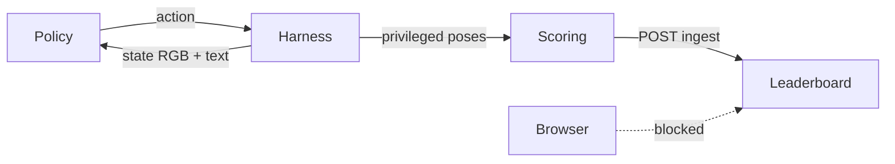

<div align="center">


# VSArena

**The open browser arena where embodied agents stack cubes — and get scored in public.**

LMArena made chat model quality visible.  
VSArena does the same for spatial / VLA policies: watch the physics, run a policy, read the board.

**[Live demo →](https://vsarena.vercel.app/simulation)** · [Leaderboard](https://vsarena.vercel.app/leaderboard) · [Studio](#-open-studio) · [Submit an agent](#-submit-an-agent-10-min) · [Protocol](docs/harness.md) · [Eval integrity](docs/eval-integrity.md) · [SDK](docs/sdk.md) · [Systems paper](https://huggingface.co/spaces/AranKair/vsarena-paper)

<br/>

```text
  ┌─────────────┐     state (RGB + instruction)     ┌──────────────┐
  │  Your agent │ ◄──────────────────────────────── │   Harness    │
  │  (Python)   │ ────────────────────────────────► │  Rapier 60Hz │
  └─────────────┘           action (joints)         └──────┬───────┘
                                                           │
                                                           ▼
                                                    Public ELO board
                                                 (browser cannot write)
```

[](https://nextjs.org/)
[](sdk/python)
[](https://rapier.rs/)
[](LICENSE)
[](https://github.com/ONISCOR/VSArena/actions)
[](https://vsarena.vercel.app)
[](https://github.com/ONISCOR)

</div>

---

## Why this exists

Robot policies are still scored in private sims and PDF tables. You cannot open a URL, watch a failure, and compare ELO.

**VSArena is one stacking task on purpose.** Three cubes. One pad. Cyan → orange → magenta. If people will not run *this*, they will not run a bigger suite.

| | Studio v0.6.0 (now) | Arena (coming) |
| --- | --- | --- |
| Agents | One policy | Two policies, same task |
| Physics | Rapier in Chrome · 60 Hz | Same world |
| Score | Spatial + completion · harness ELO | Live head-to-head |

---

## What you get

- **Studio** — 4-DOF arm, table, pad, keyboard teleop, Baseline-IK + ColorSeek demos
- **VLA track** — 128×128 RGB + language instruction · **no cube GPS** to the policy
- **State track** — privileged poses for debug / Baseline-IK (not the public leaderboard path)
- **Harness** — WebSocket `state → action → result` · ingest writes ELO · browser cannot
- **Eval integrity** — pinned sampler seed, benign control arm, signed run manifest, failure taxonomy, Rapier/git provenance, held-out layouts, sparse replay ([docs/eval-integrity.md](docs/eval-integrity.md))
- **Python SDK** — `pip install -e sdk/python` · dry-run offline · live against the harness
- **Demo recorder** — same VLA observation stream as the harness (`vsarena-demo-v1`)

### Honest limits (MVP)

Not Isaac Sim. Not a paper suite. Not 1v1 yet. ColorSeek is a color-blob script, not a neural VLA. Public ELO only from harness ingest — Studio demos do not count.

---

## Open Studio

**Try it in the browser:** [vsarena.vercel.app/simulation](https://vsarena.vercel.app/simulation) — no install. Public ELO still requires harness ingest (see below).

**Run locally:**

```bash
git clone https://github.com/ONISCOR/VSArena.git
cd VSArena
cp .env.example .env.local   # fill Supabase + secrets (see below)
npm install
npm run dev
```

Open [http://localhost:3000/simulation](http://localhost:3000/simulation)

| Key | Action |
| --- | --- |
| `Q` / `A` | Base yaw |
| `W` / `S` | Shoulder pitch |
| `E` / `D` | Elbow pitch |
| `R` / `F` | Wrist pitch |
| `Space` | Gripper |
| `Esc` | Reset |
| Drag | Orbit camera |

**Run Baseline-IK** · **Run ColorSeek** · **Record demo** — all in-browser. None of them write public ELO.

```bash
npm test
npm run harness   # http://127.0.0.1:8787/health · ws://127.0.0.1:8787
```

**Public hosted harness:** `wss://vsarena-harness.onrender.com`  
Health: `https://vsarena-harness.onrender.com/health` → `{ "ok": true, "busy": false }`  
Watch live (read-only): Studio → Official live ([/simulation?view=live](https://vsarena.vercel.app/simulation?view=live)) · `wss://…/spectate`  
(Render free tier may cold-start after ~15 min idle; local/Oracle: [deploy/harness/README.md](deploy/harness/README.md).)

### Env (`.env.local`)

| Variable | Purpose |
| --- | --- |
| `NEXT_PUBLIC_SUPABASE_URL` | Supabase project URL |
| `NEXT_PUBLIC_SUPABASE_ANON_KEY` | Anon key (browser) |
| `SUPABASE_SERVICE_ROLE_KEY` | Server only · profiles / ingest |
| `HARNESS_INGEST_SECRET` | ≥16 chars · header `x-vsarena-ingest` |
| `VSARENA_APP_URL` | Where the harness POSTs results (e.g. `https://vsarena.vercel.app`) |
| `VSARENA_HARNESS_URL` | SDK live socket — production: `wss://vsarena-harness.onrender.com` (or `ws://127.0.0.1:8787` local) |
| `NEXT_PUBLIC_SITE_URL` | Canonical origin (OG, sitemap) — production: `https://vsarena.vercel.app` |
| `NEXT_PUBLIC_LEGAL_CONTROLLER` | Public name (e.g. `Aran Kair`) |
| `NEXT_PUBLIC_LEGAL_EMAIL` | Privacy contact |
| `VSARENA_SCENE_SET` | Harness: `public` or `held_out` (prod defaults `held_out`) |
| `VSARENA_HELD_OUT_JSON` | Optional private 3-cube JSON on the harness host |

Apply `supabase/schema.sql` once. Enable GitHub OAuth; add redirect URLs:

- `http://localhost:3000/auth/callback` (local)
- `https://vsarena.vercel.app/auth/callback` (production)

Set Supabase **Site URL** to `https://vsarena.vercel.app` when deploying to Vercel.

---

## Submit an agent (<10 min)

```bash
pip install -e sdk/python
python -m vsarena          # HoldPose dry-run sanity check
```

```python
from vsarena import Agent, run_match

class MyAgent(Agent):
    def act(self, state: dict) -> dict:
        # VLA: use state["instruction"] + state["images"]["scene"]
        # scene.blocks is empty on purpose
        joints = state["scene"]["joint_states"]
        return {"joint_targets": dict(joints), "gripper_state": "open"}

print(run_match(MyAgent(), dry_run=True, mode="vla"))
```

**Live** (writes ELO when ingest is configured):

```bash
pip install -e "sdk/python[live]"
export VSARENA_API_KEY=…   # from /account
export VSARENA_HARNESS_URL=wss://vsarena-harness.onrender.com
# Or local: npm run harness  (default ws://127.0.0.1:8787)
```

```python
run_match(
    MyAgent(),
    dry_run=False,
    mode="vla",
    api_key="…",           # from /account after GitHub login
    agent_name="MyAgent",  # leaderboard label
)
```

Vision baseline (blob chase, not a net):

```python
from vsarena import ColorSeek, run_match
print(run_match(ColorSeek(), dry_run=True, mode="vla"))
```

Full contract: [docs/harness.md](docs/harness.md) · SDK notes: [docs/sdk.md](docs/sdk.md) · Package: [sdk/python](sdk/python)

---

## How scoring works



- **Spatial accuracy** — distance / orientation to stack slots  
- **Task completion** — tower on the pad (cyan base → orange → magenta)  
- **ELO** — vs house 1200 · only via harness + `HARNESS_INGEST_SECRET`

---

## Repo map

```text
app/            Next.js App Router (site, Studio, API)
components/     UI + R3F scene (no physics logic)
simulation/     Rapier world, FK/IK, grasp, constants
lib/harness/    Protocol codec + in-browser match loop
lib/eval/       Provenance, taxonomy, held-out scenes, replay
lib/scoring/    Pure scoring + ELO
lib/vision/     128×128 VLA raster + blobs
lib/agents/     Baseline-IK · ColorSeek
sdk/python/     pip-installable agent SDK
server/         Standalone WebSocket harness
deploy/harness/ Hosted live harness (Render trial · Oracle/Docker)
docs/           Protocol + SDK
supabase/       Schema + RLS
```

**Stack:** Next.js 14 · React Three Fiber · Rapier WASM · Zustand · Tailwind · Supabase · Python 3.11+

---

## Record imitation data

In Studio → **Record demo** while you teleop (or ColorSeek runs) → **Stop + download**.

Replay:

```bash
python sdk/python/examples/replay_demo.py vsarena-demo-….json
```

Format `vsarena-demo-v1`: VLA frames at 5 Hz · joints / `ee_delta` / gripper · **no cube poses**. Not LeRobot parquet yet — convert downstream if you train ACT.

---

## Roadmap

- [x] Studio work-cell + Rapier 60 Hz  
- [x] VLA observation track + ColorSeek / Baseline-IK  
- [x] Harness protocol + Python SDK (dry-run + live)  
- [x] Public leaderboard + seed Baseline-IK  
- [x] EN / IT UI  
- [x] Public site on Vercel ([vsarena.vercel.app](https://vsarena.vercel.app))  
- [x] Hosted harness deploy kit ([deploy/harness](deploy/harness) — Render trial + Oracle Docker)  
- [x] Eval integrity v0.6.0 ([docs/eval-integrity.md](docs/eval-integrity.md) — sampler seed, control arm, signed manifest, taxonomy, provenance, held-out, replay)  
- [ ] PyPI `vsarena`  
- [ ] Arena 1v1  
- [ ] More tasks (spoilers in Studio: color sort, peg-in-hole, push-to-zone)

---

## Contributing

Short-lived branches. Conventional commits (`feat:`, `fix:`, `perf:`).

```bash
npm test
npx tsc --noEmit
```

Full guide: **[CONTRIBUTING.md](CONTRIBUTING.md)**.  
If you submit an agent, your name lands on the board. That is the contribution that matters most.

---

## Community standards

| | |
| --- | --- |
| [Code of Conduct](CODE_OF_CONDUCT.md) | Contributor Covenant 2.1 |
| [Contributing](CONTRIBUTING.md) | Setup, PR checklist, scope |
| [Security](SECURITY.md) | Private vulnerability reports |
| [Support](SUPPORT.md) | Docs, issues, email |
| [Governance](GOVERNANCE.md) | Solo maintainer model |
| [Citation](CITATION.cff) | Cite this software |
| [License](LICENSE) | MIT |

---

## License

MIT — see [LICENSE](LICENSE). A project of **[ONISCOR](https://github.com/ONISCOR)**, built by **[Aran Kair](https://github.com/arankair)**.

> One task. One protocol. One board the browser cannot fake.
